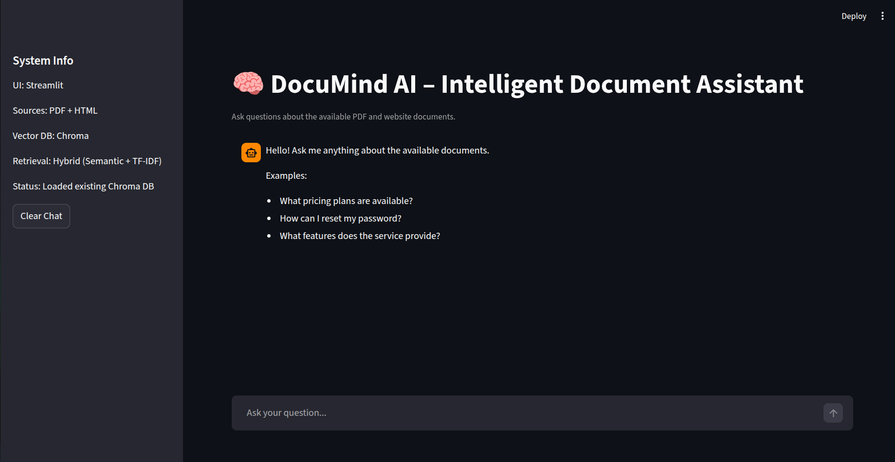
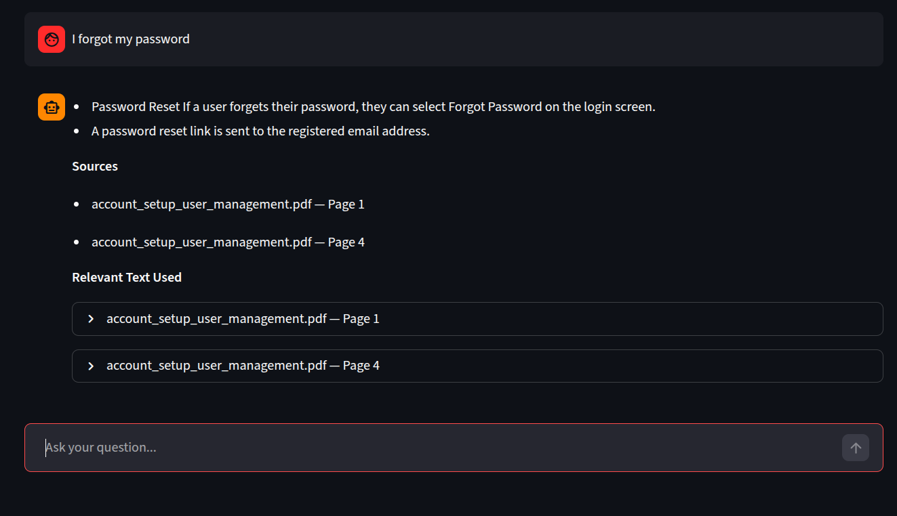
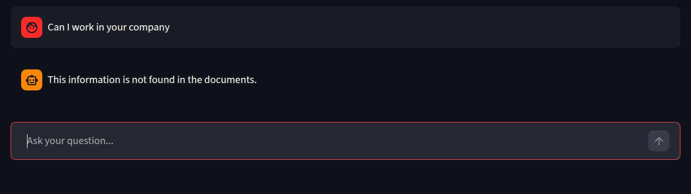

# 🚀 DocuMind AI

### Intelligent Multi-Source Document Assistant (RAG-powered)

<p align="center">


</p>

---

## 🧠 Overview

**DocuMind AI** is an intelligent AI assistant that allows users to interact with documents naturally by asking questions and receiving **accurate, grounded answers**.

Unlike traditional chatbots, DocuMind AI:

* Answers strictly from documents 📚
* Provides **source citations + evidence** 🔍
* Prevents hallucinations 🚫

---

## ✨ Key Features

🔹 **Multi-Source Understanding**

* PDFs + HTML web pages

🔹 **Hybrid Retrieval (Advanced 🔥)**

* Semantic search (Vector DB)
* Keyword search (TF-IDF)
* Smart scoring system

🔹 **Grounded Answers**

* No guessing
* No external knowledge
* 100% document-based

🔹 **Source Transparency**

* File name + page number
* Highlighted text evidence

🔹 **Robust Guardrails**

* Prevents hallucination
* Handles unknown queries

🔹 **Interactive Chat UI**

* Built with Streamlit
* Clean & responsive

---

## 🏗️ System Architecture


---

## 💬 Chat Interface



---

## 📄 Answer with Sources



---

## ⚠️ Unknown Handling



---

## ⚙️ How It Works

```
User Question
   ↓
Text Cleaning
   ↓
Hybrid Retrieval (Semantic + TF-IDF)
   ↓
Top-K Relevant Chunks
   ↓
Guardrails Validation
   ↓
Answer Generation
   ↓
Formatted Output:
   • Answer
   • Sources
   • Highlights
```

---

## 🧪 Example

**Question:**

```
How can I reset my password?
```

**Answer:**

* Click "Forgot Password"
* A reset link will be sent to your email

**Source:**

* account_setup_user_management.pdf — Page 1

---

## 🛠️ Tech Stack

* 🐍 Python
* ⚡ Streamlit
* 🧠 FastEmbed (Local Embeddings)
* 🗄️ ChromaDB (Vector Database)
* 🌐 BeautifulSoup (Web Parsing)
* 📊 Scikit-learn (TF-IDF)

---

## 📁 Project Structure

```
AI_Project/
│
├── app/
│   ├── main.py
│   ├── rag_pipeline.py
│   ├── ui.py
│
│   ├── loaders/
│   │   ├── pdf_loader.py
│   │   └── web_loader.py
│
│   ├── rag/
│   │   ├── chunker.py
│   │   ├── embeddings_store.py
│   │   ├── retriever.py
│   │   ├── qa_chain.py
│   │   ├── response_formatter.py
│   │   └── guardrails.py
│
│   └── utils/
│       └── text_cleaning.py
│
├── data/
├── chroma_db/
├── tests/
├── requirements.txt
└── README.md
```

---

## 🛡️ Guardrails (No Hallucination)

DocuMind AI ensures reliability by:

* Restricting answers to retrieved documents only
* Applying strict retrieval thresholds
* Validating response relevance
* Returning fallback when needed

📌 Example fallback:

```
This information is not found in the documents.
```

---

## 🚀 Getting Started

### 1. Clone Repository

```bash
git clone https://github.com/yourusername/documind-ai.git
cd documind-ai
```

### 2. Install Dependencies

```bash
pip install -r requirements.txt
```

### 3. Run Application

```bash
python -m app.main
```

---

## 📌 Use Cases

* 🤖 Customer Support Automation
* 🏢 Internal Knowledge Base
* ❓ FAQ Systems
* 📚 Document Search Engines

---

## 🔮 Future Enhancements

* 🧠 Conversation Memory
* 📊 Analytics Dashboard
* 🛠️ Admin Panel
* 🤖 AI Agent Integration

---

## 🎥 Demo (Recommended)

📌 Add a demo video here after recording
Example:

```
[Watch Demo](demo/demo.mp4)
```

---

## ⭐ Why This Project Matters

This project demonstrates:

✔️ Real-world AI system design
✔️ RAG pipeline implementation
✔️ Focus on reliability & trust
✔️ Production-ready architecture

---

## 📄 License

This project is licensed under the MIT License.
